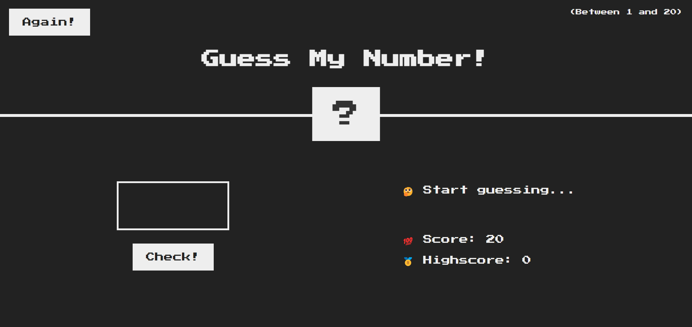
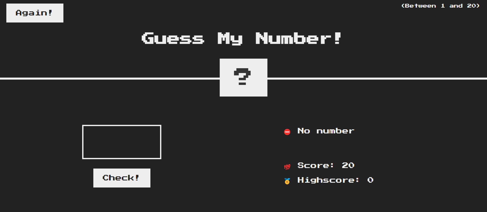
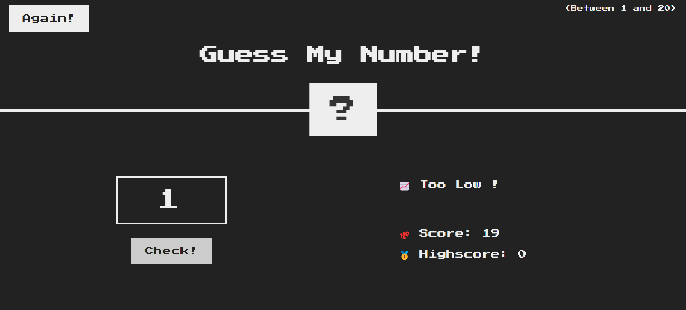
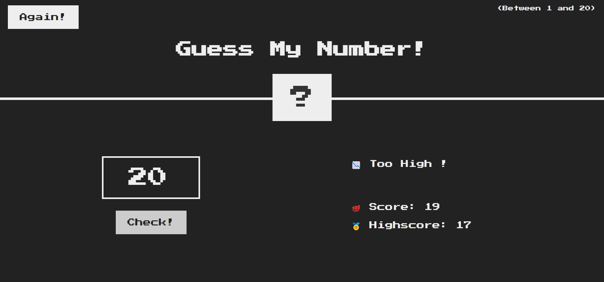
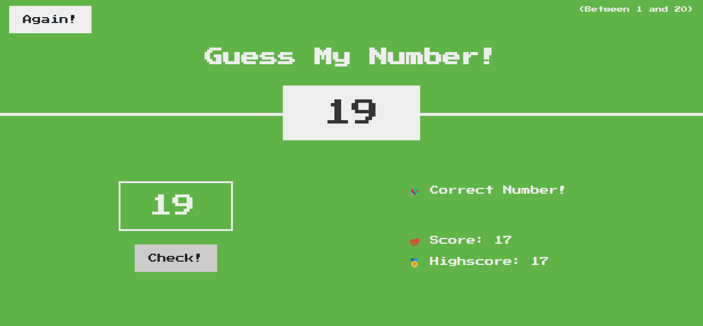

# Guess-my-number.

## About the project.

This is a very simple project that allows the user to guess a number the benefits from DOM in javascript to make chenges on both html and css file and bulid the logic of the project.

## How it works.

The programm generates a random number if the user gussed number is

- Below the randomly generated number

  - a meassage "📉 Too low" appears

- Above the randomly generated number

  - a meassage "📈 Too High !" appears

- Equal the randomly generated number

  - a meassage "🎉 Correct number !" appears

- No enterd number
  - a meassage "⛔ No number" appears

## Languages

- HTML5.
- CSS3.
- JavaScript (ES6).

## Images

  

  

  

  
  

